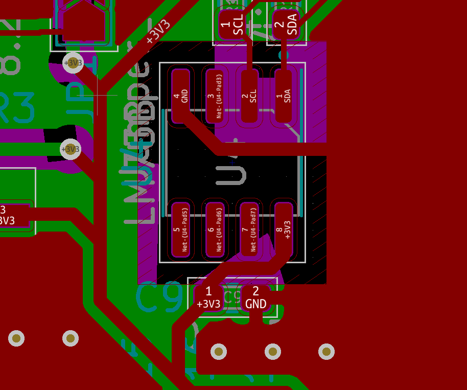

# Bugs: Prototype 01

## Floating I2C Address Pins on Temp Sensor

### Bug

Pins A0, A1 and A2 are floating. They have to be GND or 3V3.

### Fix

Connect Pin A0, A1 and A2 to 3V3 since they are near it.
